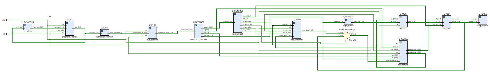
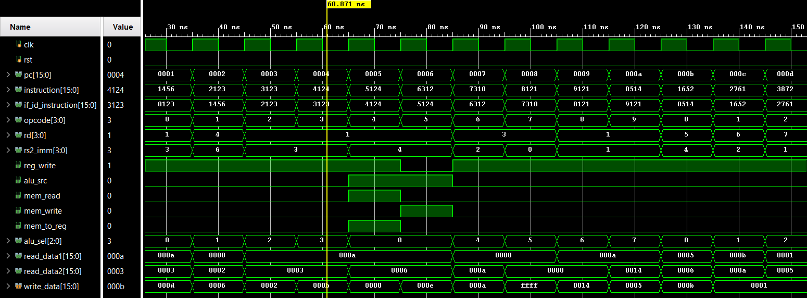
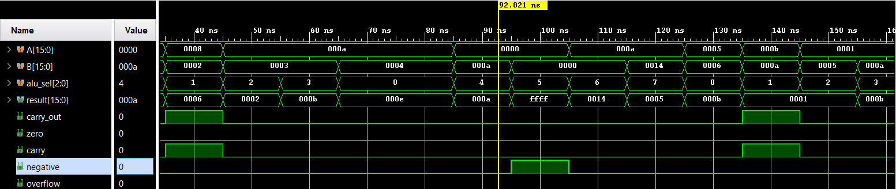
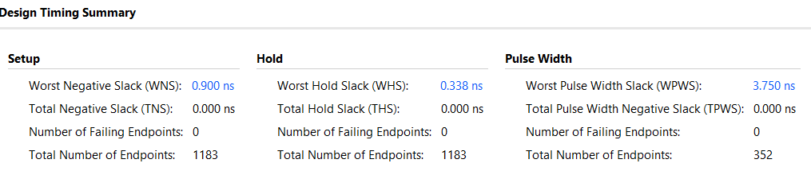
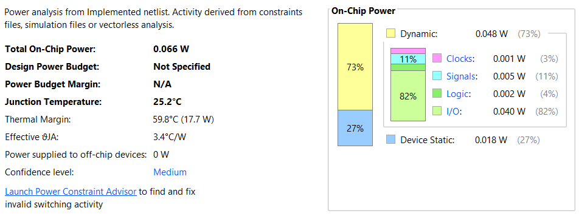

# 16-bit Single-Cycle RISC Processor with 2-Stage IF/ID Pipeline

<p align="center">

**Verilog HDL • RTL Design • Xilinx Vivado 2019.1**

</p>

---

## Overview

This project implements a **16-bit Single-Cycle RISC Processor** in **Verilog HDL** with a **2-stage Instruction Fetch / Instruction Decode (IF/ID) pipeline**. The design follows a modular RTL architecture and was verified using simulation, synthesis, implementation, timing analysis, resource utilization, and power analysis in **Xilinx Vivado 2019.1**.

The processor demonstrates the complete RTL design flow while maintaining clean, synthesizable, and reusable Verilog modules.

---

# Processor Datapath

<p align="center">

</p>

<p align="center">
<b>Figure 1.</b> Datapath architecture of the proposed 16-bit Single-Cycle RISC Processor with IF/ID Pipeline.
</p>

---

# RTL Architecture

<p align="center">

</p>

<p align="center">
<b>Figure 2.</b> RTL schematic generated after synthesis in Xilinx Vivado.
</p>

---

# Features

- 16-bit Single-Cycle RISC Architecture
- 2-Stage IF/ID Pipeline
- Modular RTL Design
- Hierarchical Verilog Implementation
- Synthesizable RTL
- Functional Verification
- Timing Analysis
- Resource Utilization Analysis
- Power Analysis

---

# Processor Organization

The processor consists of the following RTL modules:

- Program Counter
- PC Increment Logic
- Instruction Memory
- IF/ID Pipeline Register
- Instruction Decoder
- Control Unit
- Register File
- Sign Extension Unit
- ALU Operand Multiplexer
- 16-bit ALU
- Flag Register
- Data Memory
- Write Back Multiplexer

---

# Pipeline Architecture

The processor integrates a **2-stage IF/ID pipeline**.

### Stage 1 – Instruction Fetch (IF)

- Program Counter Update
- Instruction Fetch
- Instruction Memory Access

### Stage 2 – Instruction Decode (ID)

- IF/ID Pipeline Register
- Instruction Decode
- Register File Read
- Control Signal Generation

The pipeline separates instruction fetch from instruction decode, improving instruction flow while preserving a single-cycle processor architecture.

---

# Supported Operations

### Arithmetic

- ADD
- SUB

### Logical

- AND
- OR
- XOR
- NOT

### Shift

- Logical Shift Left
- Logical Shift Right

### Memory

- LOAD
- STORE

### Register Operations

- Register Read
- Register Write Back

---

# Functional Verification

## Processor Waveform

<p align="center">

</p>

<p align="center">
<b>Figure 3.</b> Processor execution showing PC progression, instruction fetch, IF/ID pipeline operation, instruction decoding, register updates, and control signal generation.
</p>

---

## ALU Verification

<p align="center">

</p>

<p align="center">
<b>Figure 4.</b> Functional verification of arithmetic, logical, and shift operations performed by the 16-bit ALU.
</p>

---

# Implementation Results

## Resource Utilization

<p align="center">

</p>

---

## Timing Analysis

<p align="center">

</p>

---

## Power Analysis

<p align="center">

</p>

---

# Development Flow

- RTL Design
- Functional Simulation
- RTL Verification
- Synthesis
- Design Implementation
- Timing Analysis
- Resource Utilization Analysis
- Power Analysis

---

# Repository Structure

```
├── rtl/
├── tb/
├── architecture/
│   ├── datapath_architecture.png
│   └── rtl_schematic.png
│
├── simulation_results/
│   ├── processor_waveform.png
│   ├── alu_waveform.png
│   ├── resource_utilization.png
│   ├── timing_summary.png
│   └── power_analysis.png
│
├── report/
│   └── Project_Report.pdf
│
└── README.md
```

---

# Tools Used

- Verilog HDL
- Xilinx Vivado 2019.1
- XSim Simulator

---

# Future Enhancements

- Hazard Detection Unit
- Data Forwarding
- Branch Prediction
- Multi-stage Pipeline
- Cache Memory
- Interrupt Handling

---

# Author

**Mythri Peddamariveedu**

Bachelor of Technology  
Electronics and Communication Engineering
